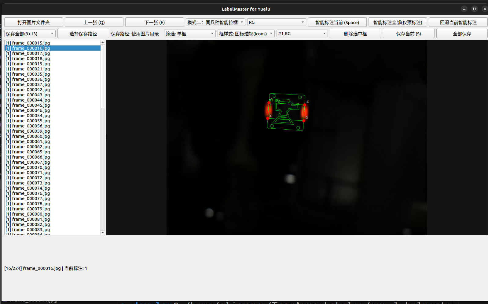

# LabelMaster for Yuelu

面向跃鹿战队数据集的装甲板标注工具。  
基于 ATLabelMaster 思路实现，保留智能标注流程，并增加队伍定制模式与标签导出格式。

## 界面预览



## 主要功能
- 模式一：智能标注（自动找框 + 自动类别）
- 模式二：同兵种智能拉框（手动指定类别，仅做找框）
- 支持旋转增强检测，提升竖放/大角度装甲板召回
- 批量智能标注为预标注模式：先检查，再手动“全部保存”
- 单张智能标注支持回退（恢复到标注前状态）
- 支持删除指定误判框、右键删除目标、角点拖拽微调
- 支持按图片标注数量筛选：无框 / 单框 / 多框
- 支持两种画框样式：
  - 默认线框
  - icons透视样式（灯条贴边）
- 支持保存路径自定义
- 支持保存格式：
  - 9点
  - 13点
  - 9+13同时保存

## 项目结构

```text
TeamArmorLabeler/
├── app/
│   └── main.py                    # 主程序入口
├── assets/
│   ├── icons/                     # 透视绘制用图标
│   ├── models/                    # 检测模型
│   │   ├── yolov5.xml
│   │   ├── yolov5.bin
│   │   └── model-opt.onnx
│   └── screenshots/
│       └── ui-preview.png         # README 界面预览图
├── packaging/
│   └── build_deb.sh               # Debian 打包脚本
├── dist/
│   └── labelmaster-for-yuelu_1.0.0_amd64.deb
├── run_labelmaster_for_yuelu.sh   # 本地启动脚本
└── README.md
```


## 标签格式

标签首位为数字类别 `cls_id`。

- `labels_9/*.txt`
```text
cls_id x1 y1 x2 y2 x3 y3 x4 y4
```

- `labels_13/*.txt`
```text
cls_id cx cy w h x1 y1 x2 y2 x3 y3 x4 y4
```

所有坐标均为归一化坐标，四点顺序为：
`1:左上 2:左下 3:右下 4:右上`

## 类别 ID 映射

| 类别 | ID | 类别 | ID |
|---|---:|---|---:|
| B1 | 0 | R1 | 7 |
| B2 | 1 | R2 | 8 |
| B3 | 2 | R3 | 9 |
| B4 | 3 | R4 | 10 |
| BS | 4 | RS | 11 |
| BO | 5 | RO | 12 |
| BG | 6 | RG | 13 |

## 检测模型
- OpenVINO（优先）：`assets/models/yolov5.xml` + `yolov5.bin`
- ONNX（回退）：`assets/models/model-opt.onnx`

## 运行方式

### 方式1：脚本直接运行
```bash
bash /home/.../TeamArmorLabeler/run_labelmaster_for_yuelu.sh
```

### 方式2：安装 deb
```bash
sudo dpkg -i /home/.../TeamArmorLabeler/dist/labelmaster-for-yuelu_1.0.0_amd64.deb
```

安装后可通过应用菜单启动，或终端运行：
```bash
labelmaster-for-yuelu
```

## 打包 deb
```bash
bash /home/.../TeamArmorLabeler/packaging/build_deb.sh
```
输出文件：
`/home/.../TeamArmorLabeler/dist/labelmaster-for-yuelu_1.0.0_amd64.deb`

## 快捷键
- `Space`：智能标注当前图
- `S`：保存当前图
- `Q / E`：上一张 / 下一张
- `Delete / Backspace`：删除当前选中目标
